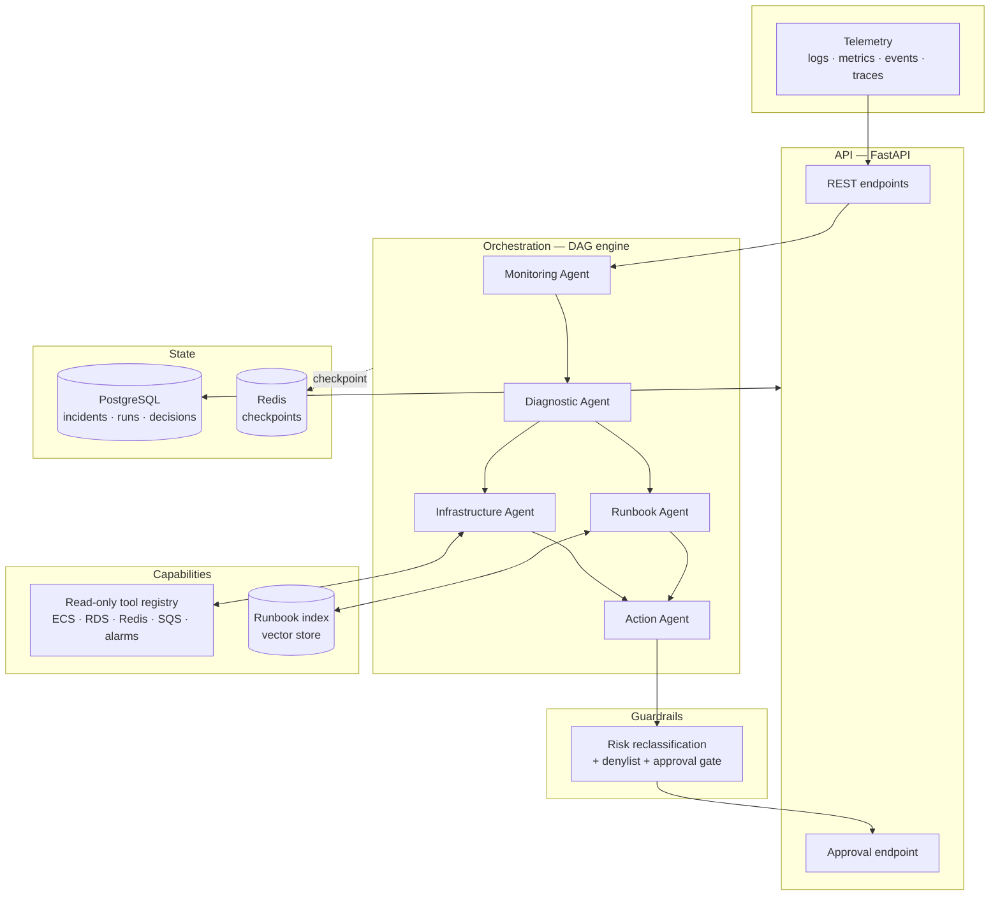

# AI Incident Commander

A multi-agent platform that investigates application and infrastructure
incidents: it ingests telemetry, correlates it, forms competing root-cause
hypotheses, verifies them against the environment with read-only tools, retrieves
the relevant runbooks, and proposes a remediation plan that a human approves
before anything happens.

**It never executes an action on its own.** That constraint is enforced
structurally, not by prompting — see [Safety & Guardrails](#safety--guardrails).

```bash
git clone https://github.com/beb0pp/ai-incident-commander.git
cd ai-incident-commander
python -m venv .venv && .venv/bin/pip install -e ".[dev]"
.venv/bin/aic demo
```

`aic demo` runs a complete investigation with a deterministic scripted model — no
API key, no database, no docker.

## Connecting it to your environment

Adoption is a YAML file, not a subclass. `aic init` writes it, `aic doctor` tells
you what is missing before an incident does:

```bash
pip install "ai-incident-commander[aws]"
aic init                 # writes aic.yaml
aic doctor               # checks credentials, permissions, connectivity
```

```yaml
# aic.yaml
sources:
  - type: aws
    region: sa-east-1
    # Omit `profile` in a deployment: the default credential chain picks up the
    # ECS task role or EC2 instance profile, with nothing to store.
    profile: prophub-readonly
    # Set `role_arn` when the account you watch is not the account you run in.
    # role_arn: arn:aws:iam::123456789012:role/incident-commander-readonly

runbooks:
  - path: ./ops/runbooks
```

`doctor` reports one line per capability, and a denial names the IAM action that
would fix it:

```
aws(sa-east-1, prophub-readonly)
  [  ok  ] credentials  arn:aws:iam::123456789012:role/reader (account 123456789012)
  [ DENY ] alarms       IAM denied cloudwatch:describe_alarms — no identity-based policy allows it
  [  ok  ] deployments

Add these IAM actions and run doctor again:
  - cloudwatch:DescribeAlarms
```

It exits non-zero when anything fails, so it works as a deployment gate.

**Adding a source that is not AWS** means implementing one protocol —
`InfrastructureClient` — and adding a `type` to the manifest. It does not mean
touching the tools, the registry, the agents, or the prompts.

[`docs/integration-contract.md`](docs/integration-contract.md) states what the
platform needs from an environment as vendor-neutral capabilities, with the
market tools that commonly provide each one — plus the questions worth asking
about an environment *before* adopting it.

---

## Overview

Incident response is a correlation problem before it is an automation problem. A
single dashboard rarely lies, but it rarely tells the whole truth either: a
service returning 5xx, a database at its connection ceiling, and a queue backing
up are frequently one cause and two symptoms, and deciding which is which is the
part that takes a senior engineer twenty minutes at 3am.

This project builds the system that does that correlation — and stops exactly
where a human's judgement is required.

**The problem it solves:** turning a pile of correlated-but-unlabelled telemetry
into a ranked set of explanations, each backed by evidence you can check, plus a
concrete plan whose blast radius has been independently assessed.

**What it is not:** an autonomous remediation system. Everything above read-only
goes to a human, by design.

---

## Key Features

| | |
|---|---|
| **Five specialized agents** | Monitoring, Diagnostic, Infrastructure, Runbook, Action — each with one job and its own testable contract |
| **Dependency-driven orchestration** | A small DAG engine with automatic parallelism, per-node retries, optional nodes, and checkpointing |
| **Structured outputs everywhere** | Agents return validated Pydantic instances. There is no "regex the JSON out of the prose" path in this codebase |
| **Tool calling with a risk gate** | The investigation registry physically cannot hold a mutating tool |
| **RAG over runbooks** | Section-aware chunking, exact cosine retrieval, and an LLM relevance pass on top — retrieval proposes, the model disposes |
| **Human-in-the-Loop** | Every action above the configured ceiling requires a recorded human decision |
| **Guardrails that don't trust the model** | Action risk is recomputed from the command text; the model's self-assessment is audit data, not authority |
| **Observability** | Structured JSON logs correlated by `run_id`, Prometheus metrics, and a full per-node execution trace on every investigation |
| **Runs with zero dependencies** | Scripted model + in-memory adapters, so the test suite is offline and hermetic |

---

## Architecture



`infrastructure` and `runbook` depend only on `diagnostic`, so the engine runs
them concurrently — the tool round-trips and the retrieval pass overlap rather
than queueing.

Full write-up: [`docs/architecture.md`](docs/architecture.md).

### Layout

```
src/aic/
├── domain/          # entities and value objects — no framework, no I/O
├── llm/             # the LLM port + Anthropic adapter + scripted client
├── tools/           # the infrastructure port, registry, AWS + simulated sources
├── rag/             # embeddings, vector store, chunking, retrieval
├── agents/          # the five agents and their prompts
├── guardrails/      # risk classification and the approval gate
├── orchestration/   # DAG engine, state, checkpointing, the pipeline
├── infrastructure/  # persistence and observability adapters
├── api/             # FastAPI routes and wire schemas
├── manifest.py      # aic.yaml — what this installation is connected to
├── diagnostics.py   # `aic doctor` probes
├── bootstrap.py     # composition root — every dependency is built here
└── service.py       # use cases, independent of HTTP
```

---

## AI Architecture

### Agents

| Agent | Input | Output | Mechanism |
|---|---|---|---|
| **Monitoring** | Raw signals | Ranked anomalies | Structured output; timestamps are taken from the signals, never from the model |
| **Diagnostic** | Anomalies + signals | Competing hypotheses with confidence | Structured output; required to produce more than one when the evidence supports it |
| **Infrastructure** | Hypotheses | Findings that confirm or refute them | Tool-calling loop over read-only tools, then a structured extraction pass |
| **Runbook** | Hypotheses + incident | Applicable procedures | RAG retrieval, then an LLM relevance filter |
| **Action** | Everything above | A remediation plan | Structured output, then the guardrail layer rewrites it |

### Model

Claude Opus 5 (`claude-opus-5`) via the official `anthropic` SDK, with adaptive
thinking and a configurable effort level. Structured outputs are used for every
agent response; the JSON Schema is derived from the same Pydantic model that
validates the reply, so a constraint is declared exactly once.

Swapping providers means implementing one protocol (`aic.llm.base.LLMClient`) —
nothing above that line imports a vendor SDK.

### Orchestration

A hand-written DAG engine rather than a graph framework. The reasoning is in
[ADR 0002](docs/adr/0002-hand-written-orchestration.md): the orchestration logic
*is* the interesting part of an agent platform, it is ~150 lines, and keeping it
in the repo means retries, parallelism, and checkpointing are all inspectable and
directly unit-tested.

### Prompt caching

System prompts are module-level constants with no interpolation, so the cached
prefix stays byte-stable across requests. All incident-specific context goes in
the user turn. Tool definitions are emitted in a stable sorted order for the same
reason.

---

## Technical Decisions

Each of these has an ADR in [`docs/adr/`](docs/adr/):

| Decision | Trade-off accepted |
|---|---|
| [Hand-written orchestration](docs/adr/0002-hand-written-orchestration.md) over LangGraph | We own the engine and its bugs; we get exactly the semantics we need and no framework lock-in |
| [Structured outputs](docs/adr/0003-structured-outputs-and-tool-loop.md) over prose parsing | Schema drift becomes a validation error at the boundary instead of a mystery downstream |
| [A manual tool loop](docs/adr/0003-structured-outputs-and-tool-loop.md) over the SDK tool runner | More code, but the loop is where retries, auditing, and guardrail hooks live — and no beta dependency |
| [In-process vector store](docs/adr/0004-in-process-rag.md) over a vector database | Exact search, zero infrastructure, hermetic tests; caps out at a corpus that fits in RAM |
| [SQL migrations](docs/adr/0005-jsonb-persistence.md) over an ORM + Alembic | Less machinery for a two-table JSONB schema; no ORM query layer if the schema normalizes later |
| [Declarative manifest](docs/adr/0006-declarative-manifest.md) over code-level wiring | Adoption is a YAML file; the safety ceiling becomes data, enforced in three places instead of hard-coded in one |
| [Guardrails recompute risk](docs/adr/0001-human-in-the-loop.md) | The model's risk assessment is never load-bearing, at the cost of maintaining classification patterns |

---

## Safety & Guardrails

The design assumption is that the model will eventually be wrong, or be talked
into being wrong. So the safety properties are structural rather than prompted:

1. **Investigation tools are read-only by construction.** `ToolRegistry` is built
   with `max_risk=READ_ONLY` and raises at registration time if handed a mutating
   tool. There is no prompt that grants an investigation write access, because
   there is no write tool in the registry to grant.

2. **The model's risk assessment is not trusted.** `ActionPolicy` recomputes every
   action's blast radius from its command text. In the bundled demo the model
   labels an `ecs update-service` rollback as `low`; the policy reclassifies it to
   `medium` and routes it to a human. Both values are kept, so the disagreement is
   visible in the audit trail.

3. **A denylist rejects, rather than gates.** Recursive deletes, `DROP DATABASE`,
   unbounded `DELETE`, disabling audit logging, and IAM privilege escalation are
   removed from the plan entirely and recorded as guardrail events.

4. **High risk is never auto-approvable.** `AIC_AUTO_APPROVE_MAX_RISK=high` fails
   validation at startup. The ceiling is configurable up to `medium`; the top of
   the scale is not.

5. **The execution gate is separate from plan generation.** `assert_executable`
   re-derives risk and demands a matching approval record, so holding a stale plan
   object is not a way around the gate.

### Limitations — stated plainly

- **The AWS source is real but lightly exercised.** `AwsInfrastructure` calls
  boto3 for ECS, RDS, ElastiCache, SQS, and CloudWatch, and translates IAM
  denials into the action you need to add. It has been verified against the
  simulated source and the error paths; it has not yet run a full investigation
  against a production account. The simulated source remains the default so the
  repo stays clonable with no credentials.
- **Nothing executes.** There is no executor. `assert_executable` exists so that
  one added later cannot skip the gate, but this repository proposes and stops.
- **The embedder is lexical, not semantic.** `HashingEmbedding` matches
  vocabulary. It retrieves well over a few dozen runbooks and is honest about
  what it is; a hosted embedding model implements the same protocol.
- **Investigations run inline.** The API awaits the pipeline. Production would
  enqueue and return `202` — see the roadmap.

---

## Observability

- **Logs.** structlog, JSON in every environment except a developer terminal.
  Every line carries `request_id` and, inside an investigation, `run_id`, so one
  incident's full trace comes out of a shared stream with a single filter.
- **Traces.** Every investigation records a `NodeTrace` per agent: status,
  attempt count, wall-clock duration, and the error if it failed. It is returned
  on the API response, not just logged.
- **Metrics.** Prometheus at `/metrics`:

  | Metric | Answers |
  |---|---|
  | `aic_investigations_total{status}` | Are investigations reaching a useful conclusion? |
  | `aic_investigation_duration_seconds` | How long does one take? |
  | `aic_agent_runs_total{agent,outcome}` | Which agent is flaky? |
  | `aic_agent_duration_seconds{agent}` | Where does the time go? |
  | `aic_tool_calls_total{tool,outcome}` | Which integration is failing? |
  | `aic_llm_tokens_total{direction}` | What does this cost? |
  | `aic_guardrail_events_total{kind}` | How often is the model's risk assessment wrong? |
  | `aic_approvals_total{outcome}` | Are humans approving or rejecting? |

`aic_guardrail_events_total{kind="reclassified"}` is the one to watch: it is a
direct measure of how often the model under-reports blast radius.

---

## Testing Strategy

```bash
.venv/bin/pytest                    # unit + API integration, offline
.venv/bin/pytest -m integration     # adds Postgres/Redis (docker compose up -d)
.venv/bin/ruff check . && .venv/bin/mypy
```

- **Unit tests** cover the domain, the guardrail policy (including that a
  `DROP DATABASE` proposal is removed and an understated rollback is
  reclassified), the DAG engine's cycle detection, parallelism, retries, and
  optional-node degradation, the tool registry's three failure modes, the schema
  sanitizer, and RAG chunking and retrieval.
- **Agent tests** drive each agent with a scripted model and assert on the domain
  objects produced — including that an anomaly citing no real signal is dropped.
- **Adapter tests** drive the real `AnthropicLLMClient` against a stub SDK client,
  covering the tool loop: `pause_turn` resumption, the iteration budget, error
  results reaching the model, and that all results for one turn go back in a
  single user message. A `stop_reason: "refusal"` — which arrives as a normal
  HTTP 200 with an empty body — is asserted to raise rather than return silently.
- **API tests** run the real app against `httpx.ASGITransport` with in-memory
  adapters, covering the full create → investigate → approve flow.
- **Integration tests** (marked, opt-in) exercise the Postgres repository and the
  migration runner against a real database.

The whole default suite runs with no network, no API key, and no docker, which is
what keeps it fast enough to run on every save.

---

## Getting Started

### Prerequisites

- Python 3.12+
- Docker and Docker Compose (only for the Postgres/Redis path)
- An Anthropic API key (only for the real-model path)

### Environment

```bash
cp .env.example .env
```

| Variable | Default | Notes |
|---|---|---|
| `AIC_LLM_PROVIDER` | `fake` | `fake` \| `anthropic` |
| `AIC_LLM_MODEL` | `claude-opus-5` | |
| `AIC_LLM_EFFORT` | `high` | `low` … `max` |
| `ANTHROPIC_API_KEY` | — | Required only when provider is `anthropic` |
| `AIC_AUTO_APPROVE_MAX_RISK` | `read_only` | Up to `medium`; `high` is rejected |
| `AIC_DATABASE_URL` | local Postgres | Falls back to in-memory when unset at build time |
| `AIC_REDIS_URL` | local Redis | Falls back to in-memory |

### Run it

```bash
# 1. The whole pipeline, no dependencies at all
aic demo

# 2. The API, in-memory
aic serve                       # http://localhost:8000/docs

# 3. The full stack
docker compose up --build       # API + Postgres + Redis, migrations applied on boot
```

### Drive the API

```bash
# Open an incident and investigate in one call
curl -sX POST localhost:8000/incidents \
  -H 'content-type: application/json' \
  -d @docs/examples/incident.json | jq

# Inspect the full audit trail
curl -s localhost:8000/incidents/$ID/investigation | jq

# Approve a gated action
curl -sX POST localhost:8000/incidents/$ID/actions/$ACTION_ID/decision \
  -H 'content-type: application/json' \
  -d '{"approved": true, "decided_by": "sre-oncall", "comment": "confirmed the connection ceiling"}'
```

---

## Roadmap

- **Async investigations.** Enqueue on `POST /incidents`, return `202`, stream
  progress over SSE. The checkpoint store already supports it; the API does not
  yet use it.
- **MCP as a source type.** `- type: mcp` in the manifest, so any MCP server
  becomes a tool surface without writing an adapter at all — with a per-server
  allowlist, since MCP tools do not declare their own blast radius.
- **Signal collectors.** A `triggers:` section so a CloudWatch alarm or a
  PagerDuty webhook assembles its own signal window, removing the ingest
  Lambda an adopter currently has to write.
- **An executor** for approved actions, behind `assert_executable`, with a
  dry-run mode and automatic rollback on failed verification.
- **`search_logs` capability.** Metrics say *that* something broke; logs say
  *what*. Bounded queries against Logs Insights, Loki, or Elasticsearch.
- **`query_system_of_record` capability.** Telemetry retention is short and
  incidents get reported late, so the application database is often the only
  durable evidence left. Read-only, against a replica, parameterized, with a
  row cap and column exclusions enforced by the tool.
- **Semantic embeddings + pgvector**, once the runbook corpus outgrows the
  process.
- **Evaluation harness.** A fixture set of incidents with known root causes,
  scoring hypothesis rank and action appropriateness, so prompt changes are
  measured rather than guessed at.

---

## License

MIT — see [LICENSE](LICENSE).
