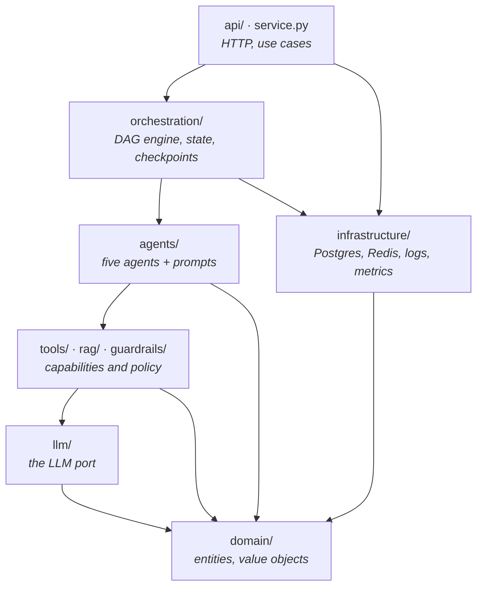
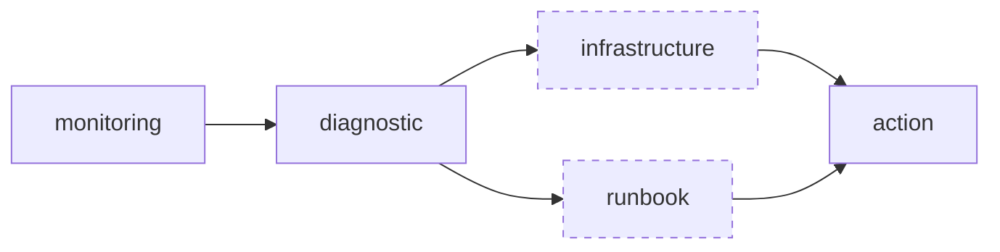
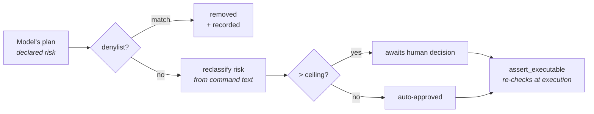

# Architecture

How the AI Incident Commander is put together, and why. Decisions with real
trade-offs have their own ADR in [`adr/`](adr/); this document is the map.

---

## The shape of the problem

Incident response is a correlation problem before it is an automation problem.
The hard part is rarely reading one dashboard — it is deciding which of three
simultaneously-unhappy systems is the cause and which two are symptoms.

That framing produces the architecture directly:

| The problem needs | The system provides |
|---|---|
| Many signal shapes reduced to one | A normalization step ahead of everything else |
| Competing explanations, not one confident answer | Ranked hypotheses with confidence and evidence |
| Explanations checked against reality | A tool-calling agent with read-only access |
| Institutional knowledge applied correctly | Retrieval, then a relevance judgement on top |
| Action without unattended risk | Guardrails outside the model, plus a human gate |

---

## Layers

Dependencies point inward. `domain` imports nothing from the project; the API
imports everything and is imported by nothing.

Two rules keep this honest:

- **Agents do not know about the graph engine.** They declare `name`,
  `depends_on`, and `optional` as class attributes; `pipeline.py` reads those and
  builds the nodes. The dependency points orchestration → agents, never back.
- **Nothing above `llm/` imports a vendor SDK.** `AnthropicLLMClient` and
  `ScriptedLLMClient` implement the same two-method protocol, which is why the
  entire test suite runs offline against real agent code.

`bootstrap.py` is the only place any of this is wired together.

---

## The investigation graph

Dashed nodes are optional: their failure is recorded and their dependents are
skipped, but the investigation continues. Solid nodes abort the run.

The engine derives execution levels from the declared dependencies, so
`infrastructure` and `runbook` run concurrently without anyone writing an
`asyncio.gather`. State is checkpointed after every level.

| Node | Retries | Optional | Timeout | Why |
|---|---|---|---|---|
| `monitoring` | 1 | no | 120s | Without anomalies there is nothing to investigate |
| `diagnostic` | 2 | no | 120s | Everything downstream is scoped by its hypotheses |
| `infrastructure` | 1 | **yes** | 180s | Tool integrations are the flakiest real dependency |
| `runbook` | 1 | **yes** | 120s | Missing documentation should not stop an investigation |
| `action` | 2 | no | 120s | The deliverable |

### State

`InvestigationState` is one serializable Pydantic model carrying the incident,
the signals, each agent's output, a `NodeTrace` per node, token usage, and
accumulated errors. Serializability is what makes checkpointing, resuming, and
post-mortem inspection possible — and it means an agent that cannot express its
output as a field on this model is doing something the system cannot audit.

---

## Agents

Each agent is narrow enough to unit-test against fixed model output.

### Monitoring

Flattens raw telemetry and triages it into ranked anomalies.

Two things it is *not* allowed to do. Timestamps come from the signals, never
from the model — a hallucinated timestamp silently corrupts the incident
timeline. And an anomaly citing no real signal id is dropped, because unsourced
output must not be allowed to seed a hypothesis downstream.

### Diagnostic

Produces competing root-cause hypotheses with confidence scores and evidence
references. The prompt asks explicitly for more than one when the evidence
supports it: a single hypothesis stated confidently is how incidents get
misdiagnosed. Output is capped at five and sorted by confidence.

### Infrastructure

The only agent that runs a tool loop. Its registry is built with
`max_risk=READ_ONLY`, which is what makes "it can look but not touch" a
structural property rather than a prompt instruction. The loop transcript is then
converted into discrete `InfrastructureFinding` objects by a second structured
call, so findings are typed data rather than a wall of tool output.

A finding that a resource is *healthy* is recorded explicitly. Refuting a
hypothesis is as valuable as confirming one.

### Runbook

Retrieval, then judgement — see [ADR 0004](adr/0004-in-process-rag.md). The
retriever proposes candidates by lexical similarity; the model decides which
genuinely apply and may return none.

### Action

Consolidates everything into a plan and hands it to the guardrail layer, which
rewrites it. See below.

---

## Safety

The full argument is [ADR 0001](adr/0001-human-in-the-loop.md). The mechanism:

The load-bearing property is that **the model's declared risk is never used to
make a decision** — only recorded, so a disagreement is visible in the audit
trail and countable on a dashboard.

---

## Persistence and observability

Persistence is JSONB documents behind a repository protocol, with SQL migrations
applied under an advisory lock — [ADR 0005](adr/0005-jsonb-persistence.md).
Checkpoints go to Redis so any API replica can read any run's state.

Observability is three surfaces that answer different questions:

- **Logs** (structlog, JSON) — what happened, correlated by `request_id` and
  `run_id`.
- **Traces** (`NodeTrace`, on the API response) — which agent did what, how long
  it took, how many attempts. Returned to the caller, not just logged: an
  investigation's audit trail is part of its output.
- **Metrics** (Prometheus, `/metrics`) — aggregate health, cost, and how often
  guardrails are firing.

---

## What is deliberately not here

- **An executor.** Nothing applies an approved action. `assert_executable` exists
  so that an executor added later cannot skip the gate.
- **A real cloud integration.** `SimulatedEnvironment` returns `boto3`-shaped
  fixtures. Swapping it is one class; keeping it is what makes this repository
  runnable by anyone who clones it.
- **Async investigations.** The API awaits the pipeline. The checkpoint store
  already supports the async model; the API does not use it yet.
- **Semantic embeddings.** See [ADR 0004](adr/0004-in-process-rag.md).
